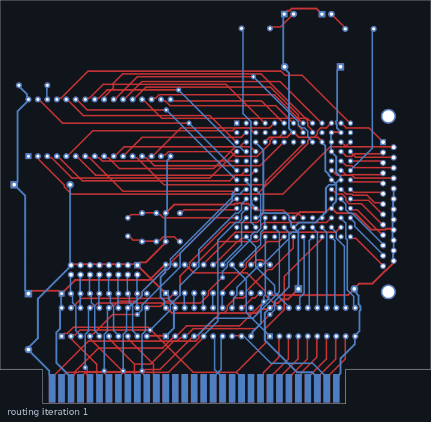
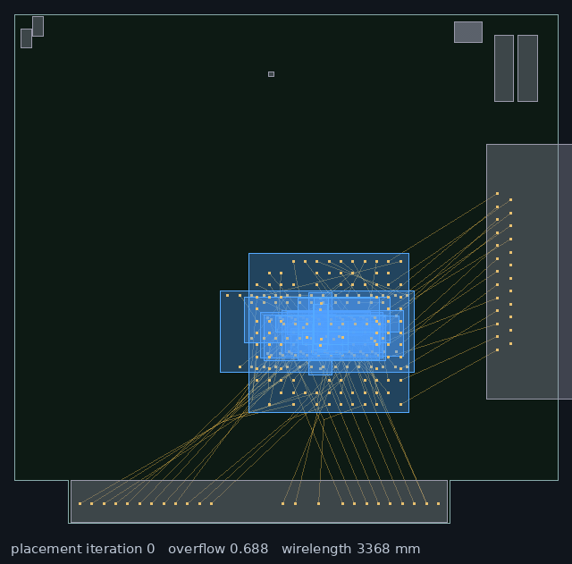

# pcb-maker

**Automatic placement and routing for KiCad boards, judged by KiCad itself.**

`pcb-maker` takes a KiCad project, places the footprints that are free to
move, routes every net, and hands the board back to KiCad's own ERC and DRC
before it calls the job done. It is a research project, written in Rust, with
one goal: the best open-source PCB placer and router.

<p align="center">
  
  <br>
  <sub>Routing the 110-net Interf-U demo from a bare board: every net is routed at once, conflicts are priced up, and only the losers move. The last frame is what KiCad accepted.</sub>
</p>

## Status

Not finished, but already useful. On the [18-board corpus](docs/benchmarks.md)
built from the KiCad demos, Olimex and generated ESP32 boards:

- **Routing** (designer's placement kept, tracks and vias stripped): 12 of
  the 13 two-layer boards complete and DRC-clean. Of the four-layer boards,
  OpenAir is clean, ColdFire and the video board are a few nets short, and
  Tiny Tapeout (whose source already fails DRC) is well short. Head to head
  with Freerouting on the same cold boards: pcb-maker completes 12 of 13,
  Freerouting 8 of 13, with less copper on every board and fewer vias on
  four of the seven boards both finish.
- **Placement + routing** (every movable footprint re-placed from scratch):
  11 of the 13 two-layer boards clean, one more with a single thermal-relief
  finding; the automatically placed Interf-U routes with fewer vias than the
  human layout.
- **Not there yet:** dense two-sided boards can leave the placer without a
  legal solution, large four-layer boards take 10–20 minutes, big copper
  pours on both layers of a two-layer board are still the weak spot, and
  there is no differential-pair, length-matching or pin-swap support. The
  hardest board in the corpus, a 186-footprint two-layer design with a
  0.75 mm BGA and a 3.3 V pour on both layers, is DRC-clean but stops at
  153 of 180 nets with the designer's placement and 161 with automatic
  placement.

Take a look at the [benchmarks](docs/benchmarks.md) before trusting any
number here; they are re-run and rewritten as the code changes.

## Try it

You need KiCad 9 or newer on the `PATH` (`kicad-cli` runs the final
verification) and either a [snapshot build](https://github.com/floitsch/pcb-maker/releases/tag/snapshot)
(rebuilt on every push to `main`) or a Rust toolchain:

```sh
cargo build --release          # target/release/pcb-maker
```

### Route a board

```sh
pcb-maker route-kicad-board <project-dir> <board-id> <out-dir> auto
```

`<board-id>` is the file stem (`myboard` for `myboard.kicad_pcb`), `auto`
takes track widths, clearances, via sizes and net classes from the project's
`.kicad_pro`. Existing tracks and vias are replaced; copper zones stay and
are used: pads are connected to their pour, islands are stitched, and if
that leaves something open the pour nets are routed as tracks instead.
`<out-dir>` must not exist yet; it receives a copy of the project with the
routed board, KiCad's ERC and DRC reports, and `board-router.json` with
per-net results. The exit code is non-zero if anything is unconnected or
violates a rule.

### Place and route

```sh
pcb-maker layout-kicad-board <project-dir> <board-id> <out-dir> auto [layout.json]
```

Everything that is not locked, has no nets, or sits on the board edge (a
connector) is placed anew, then routed. The result lands in `<out-dir>/result`
together with `placement.html`, an animated playback of the placement. A
small JSON keeps parts where the designer put them:

```json
{"placer": {"fixed_patterns": ["J*", "H*"], "fixed": ["U3"]}}
```

<p align="center">
  
  <br>
  <sub>Placement of the same board: parts start on top of each other and spread out under net attraction and density repulsion, then are snapped to a legal, routable layout.</sub>
</p>

### Placement only

```sh
pcb-maker place-kicad-board <project-dir> <board-id> <out-dir> [placer.json]
```

## How it works

**The router** ([docs/router.md](docs/router.md)) is a whole-board
negotiated-congestion router in the PathFinder family. The board is lowered
to a lattice whose pitch is chosen from the pads on it; every net is routed
against the same occupancy maps, overlapping other nets' clearance at a
price that rises from iteration to iteration, until nothing overlaps. On top
of that: a coarse tile graph plans corridors before the fine search runs,
fine-pitch pads get pre-computed escapes, copper pours are first-class
(thermal guards, plane connections, island stitching), and an attempt
ladder retries with a plane skeleton, with pours as tracks, and with finer
lattices when something stays open. Finished boards go through a via
reduction pass and an exact geometric verifier before KiCad sees them.

**The placer** ([docs/placer.md](docs/placer.md)) is an electrostatic
global placer in the ePlace/RePlAce tradition: footprints are charges,
their density field is solved on a grid, nets pull with a smooth wirelength
model, and every part keeps a halo sized to the tracks that must escape it.
Global placement is followed by annealing on rotations and positions and a
legalisation step. The **layout loop** ([docs/coupling.md](docs/coupling.md))
then routes, reads the congestion back into the halos, and tries footprint
moves that reduce open connections.

**Verification** is never skipped. Both the router and the placer keep their
own exact checks, and every board that leaves the tool has been through
native KiCad ERC, DRC and connectivity. `pcb-maker` reports what KiCad says,
not what it hopes.

## Benchmarks

Route mode on cold two-layer boards, one thread, same rules and same DRC for
every router (full table and method in [docs/benchmarks.md](docs/benchmarks.md)):

| Board | pcb-maker | Freerouting 2.2.4 |
| --- | --- | --- |
| Interf-U (110 nets) | complete, 30 vias, 4654 mm, 109 s | complete, 44 vias, 5051 mm, 44 s |
| PIC programmer (34) | complete, 1 via, 1911 mm, 4 s | 1 open, 0 vias, 2101 mm, 7 s |
| Complex hierarchy (50) | complete, 0 vias, 1330 mm, 1 s | 1 open, 0 vias, 1377 mm, 8 s |
| ESP32-C6 DUT (42) | complete, 26 vias, 1274 mm, 22 s | complete, 29 vias, 1355 mm, 14 s |
| Multichannel (79) | complete, 20 vias, 2578 mm, 75 s | 180 open, 16 s (likely an adapter setup problem, [being checked](docs/todo.md)) |
| StickHub (45) | 4 open, 53 vias, 13 s | 2 open, 44 vias, 66 s |

```sh
benchmarks/corpus/fetch.sh                      # downloads the KiCad demos
python3 benchmarks/corpus/run.py build/corpus   # route and layout for every board
```

## Repository

| Crate | What it is |
| --- | --- |
| `crates/pcb-router` | the format-independent routing core: geometry, lattice, negotiation, pours, verifier |
| `crates/pcb-placer` | the electrostatic placer, annealer, legaliser and playback |
| `crates/pcb-kicad` | KiCad S-expression parsing and writing, project rules, the board adapters, native verification |
| `src/main.rs` | the `pcb-maker` command line |
| `benchmarks/corpus` | the board corpus runner and the Freerouting / tscircuit comparisons |
| `docs/` | design notes, results and the trust audit that reset the project |

The other crates (`pcb-engine`, `pcb-grid-router`, `layout-trace-*`, …) are
earlier approaches kept for their tests and experiments; the
[trust audit](docs/reviews/2026-09-21-trust-audit.md) explains what was
kept and why.

## License

MIT, see [LICENSE](LICENSE).
