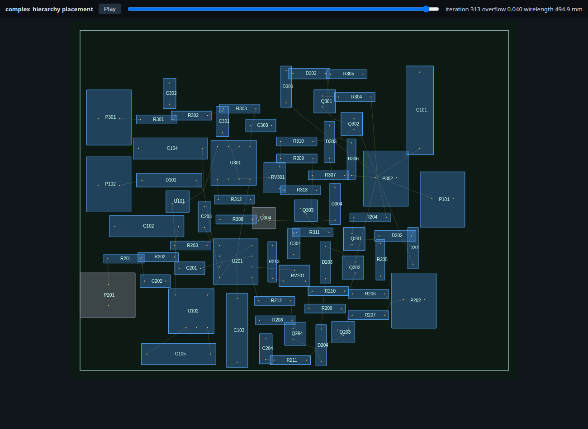
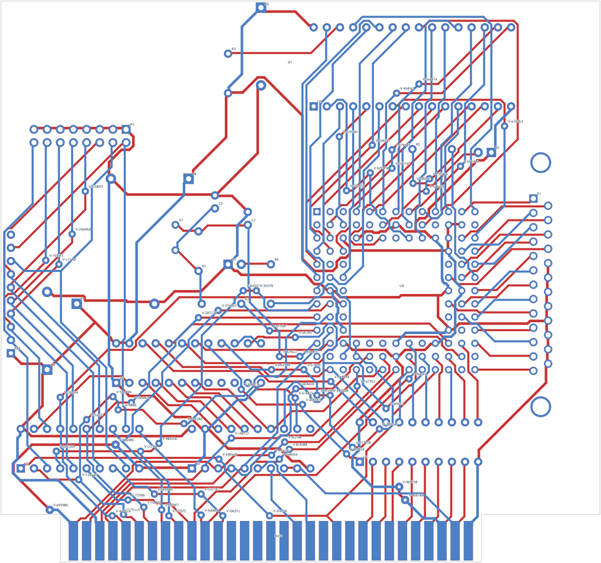

# The placer (`pcb-placer`) and the coupled layout loop

`pcb-placer` replaces the spring-plus-pairwise-pushing placer described in the
[trust audit](reviews/2026-09-21-trust-audit.md). Together with
[`pcb-router`](router.md) it forms the automatic layout flow:

```sh
# Placement only (writes the project plus placement.html, an animated playback)
cargo run --release -- place-kicad-board <source-dir> <board-id> <out-dir> [placer.json]

# Coupled placement and routing
cargo run --release -- layout-kicad-board <source-dir> <board-id> <out-dir> <router.json> [layout.json]
```

## Results (2026-09-21, cold: all movable footprints re-placed, zero copper)

Every board below is placed and routed automatically, is electrically complete
in native KiCad (zero unconnected items, zero clearance/courtyard findings) and
has zero internal violations. The only remaining native findings are
silkscreen label cosmetics (2–19 per board), which the existing
`repair-kicad-silkscreen` tool reduces further.

| Board | Movable | Auto placement → routed | Human placement → routed |
| --- | ---: | --- | --- |
| ECC83 | 6 / 15 | 9/9, 0 vias, 368 mm | 9/9, 1 via, 344 mm |
| Complex hierarchy | 66 / 68 | 50/50, 0 vias, 1318 mm | 50/50, 0 vias, 1330 mm |
| PIC programmer | 55 / 63 | 34/34, 1 via, 1722 mm | 34/34, 1 via, 1907 mm |
| Interf-U | 22 / 25 | 110/110, 71 vias, 5103 mm | 110/110, 58 vias, 4789 mm |

Placement takes 0.6–3 s, routing 0.2–25 s. Both routed columns use the same
router and rules. On Interf-U the human placement is still better (fewer vias,
less copper); on PIC and the hierarchy board the automatic one is.

| Global placement (hierarchy board) | Placed and routed (Interf-U) |
| --- | --- |
|  |  |

## How it works

1. **Lowering.** Footprints become bodies (courtyard plus pad bounding box,
   rectangular or round) with pins at their true offsets. Locked footprints,
   footprints without nets, and footprints on the board edge (connectors) stay
   fixed; everything else may move and turn in 90° steps. Large nets get a
   smaller weight so power does not collapse the layout.
2. **Routing halos.** A PCB routes in the same plane it places in. Every body
   gets a halo proportional to its pin count; halos count as body area and as
   spacing. If the board cannot afford them they shrink uniformly.
3. **Global placement** (ePlace/RePlAce formulation). Body area is electric
   charge; the potential solves Poisson's equation on the board with a
   spectral method, so the spreading force acts at a distance and points to
   free space. Fixed parts and everything outside the outline are fixed
   charge; filler charge decides how much whitespace stays between the parts.
   Wirelength is the weighted-average model on true pin positions. Nesterov's
   method with a Barzilai–Borwein step minimizes
   `wirelength + lambda * density` while `lambda` grows until overlap is gone.
   Rotations are chosen greedily every few iterations.
4. **Annealing legalization.** Moves, quarter turns and swaps are judged on
   wirelength plus an overlap penalty that grows until no overlap survives.
   It starts cold so the global result is refined, not scrambled. An exact
   nearest-legal-position pass is the safety net, with relaxation levels
   (smaller halos, then no spacing) for crowded boards.
5. **Refinement.** Greedy legal moves, rotations and swaps that strictly
   reduce wirelength.
6. **Coupling.** `layout-kicad-board` routes the placement once, then the
   router and placer take turns on one in-memory state: congested footprints
   are nudged, the router reroutes only what the nudge touched, and moves are
   kept when the board improves. See [coupling.md](coupling.md).

The written board is checked: every pad must land exactly where the placer's
model said it would, including rotated footprints (KiCad stores pad and text
angles as absolute values).

## What went wrong on the way (kept as lessons)

- A density target below 1 can never be met when every part is larger than a
  bin; overflow plateaued at 0.24–0.40 and the layout froze. Bodies are now
  exclusive at density 1 and whitespace is controlled by halos and fillers.
- Greedy largest-first legalization doubled the wirelength by exiling small
  passives. The global placement was fine; the annealing legalizer fixed it.
- Minimum wirelength is not routability: the most compact Interf-U placement
  has the best wirelength and does not route. Only routing feedback tells.

## Known limits / next steps

- Bodies are rectangles or discs; rotations are quarter turns; the board side
  of a footprint is never changed.
- No constraint language yet (regions, groups, alignment, decoupling
  proximity, keep-near-edge); fixed/free lists are the only user control.
- Congestion drives nudges of individual parts, but does not yet feed the
  global placer's density term (coupling step 3).
- Silkscreen labels are not placed; the separate repair tool handles most.
- No pin or gate swapping.
- The spectral solve is a direct O(n^3) cosine transform (64 bins); an FFT or
  a GPU kernel becomes relevant for boards with thousands of parts.
