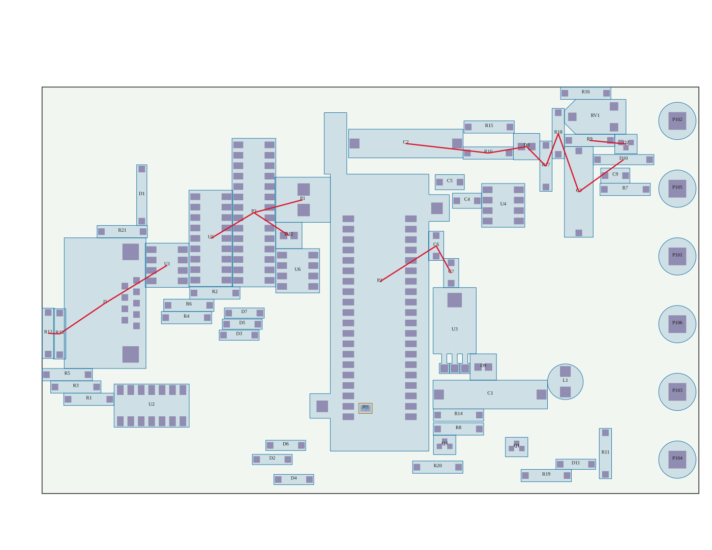
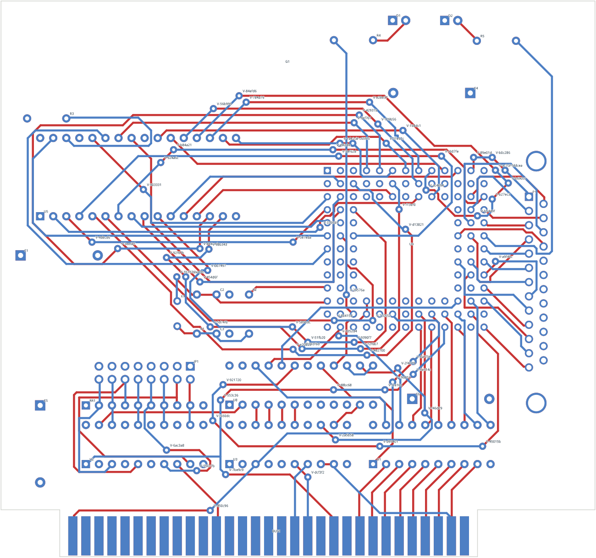
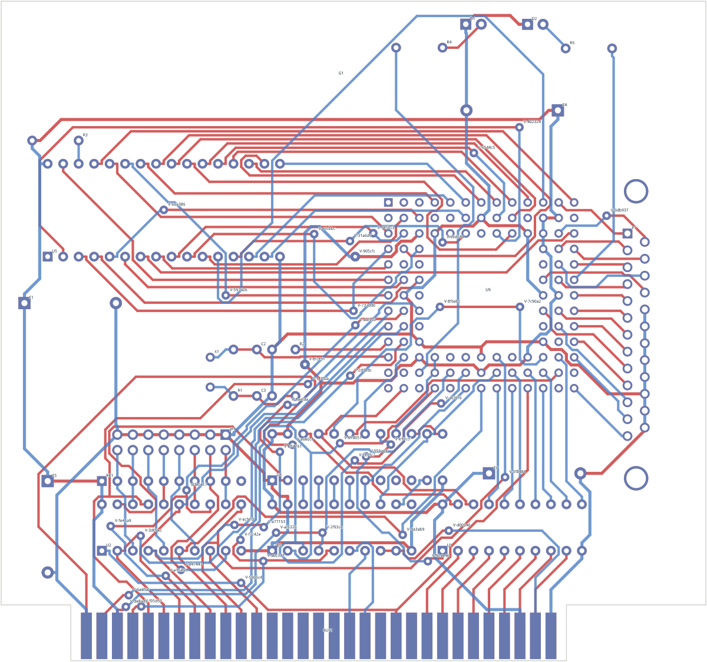

# Trust audit — what actually works (2026-09-21)

Goal of the project: **build the best open-source PCB placer/router.**

This audit re-ran the load-bearing claims with a fresh build of the current
tree, looked at the outputs, and read the code of the three core mechanisms
instead of the documents describing them. Raw outputs are in
`build/audit-2026-09-21/` (not versioned). It supersedes the capability claims
in `README.md`, `docs/current-status.md` and the checkmarks in
`docs/competitive-roadmap.md` wherever they disagree.

## Scorecard

| Area | Verdict | Fresh evidence |
| --- | --- | --- |
| KiCad import/export, rule extraction, pad geometry lowering, native final gate | **Works, keep** | Every fresh run round-trips through native KiCad cleanly; 0 of 90 per-net candidates were rejected by KiCad DRC on Interf-U, i.e. the internal geometry model is already correct by construction for this board class. |
| Benchmark corpus + Freerouting adapter | **Works, keep** | Freerouting fresh on Interf-U: complete, native-clean, 48.9 s routing, 92 s wall, 44 vias. Reproduces the retained claim. |
| Internal router, small board (ECC83, 9 nets) | **Completes, absurdly slow** | 9/9 nets, 104 s — about 11.5 s per net. Byte-identical to the retained result. |
| Internal router, medium board (Interf-U, 110 nets) | **Fails** | 1800 s cap hit. Pass 0: 94/110 nets, 69 vias, GND/VCC and most edge-connector fingers open. 799 s for pass 0 (90 ordinary commits at 4.45 s each = 400 s; 4 rip-up repairs = 362 s), then 361 s of "forecasts", then pass 1 restarts from zero copper. Freerouting: everything, in 49 s. |
| Force-based placement | **Does not work** | Fresh PIC all-free placement *rejected*: overlapping pairs fall 74 → 15 in the first 126 sweeps, then stay at 15–16 for the remaining ~380 sweeps until the budget is exhausted. Components sit jammed in contact chains next to large empty board regions. |
| Insertion placement (the fallback that "succeeds") | **Legal, not good** | Produces a blob around the seed; on PIC the movable parts occupy 58×65 mm of a 160×99 mm board, HPWL 2174 vs. 1489 for the human layout. |
| "Cold placement" benchmarks | **Overstated** | The driver fixes every rotation to the human designer's orientation, emits no constraints, requires rectangular boards without rule areas. Rotation/side/edge-affinity/grouping are not optimized. |
| Continuous "physics" engine | **Toy, not on any real path** | Never called by the whole-board routers. Accepts only via-free, single-layer, two-pad chains with ≤256 points. |
| GPU readiness | **Nominal** | An enum list asserted by one test; no `wgpu`, no colouring, order-dependent Gauss-Seidel. |
| `pcb-routing` + `layout-trace-routing` (37k lines, incl. negotiated congestion, route families, corridors) | **Unreachable from real boards** | `pcb-kicad` depends on neither crate. |

*Fresh PIC placement after 512 sweeps. Red lines are pairs that still overlap.
Note the empty board area right next to the jammed clusters.*

| Internal router, pass 0 (94/110, 1800 s cap) | Freerouting (110/110, 49 s) |
| --- | --- |
|  |  |

## Why: the three architectural failures

### 1. The router is a file-to-file single-net tool inside an evidence journal

- There is **no in-memory board**. Every route attempt re-reads and re-parses
  the `.kicad_pcb`, rebuilds the obstacle model, and rebuilds the whole-board
  raster by running exact geometry queries at every grid node and edge
  (1.6 M nodes at 0.125 mm — ~3 s, versus <0.1 s of A*). A* is under 3 % of
  runtime.
- Every committed net copies the project directory, spawns `kicad-cli` for
  DRC + parity, spawns it again for an SVG preview, hashes, and rewrites
  journals. That is ≥4.5 s per net with zero failures — a 110-net board costs
  ~500 s before any difficulty appears, 10× Freerouting's total.
- Conflict handling is **sequential with frozen commits**. The only recovery is
  a brute-force single-net rip-up (remove each routed net in turn, rebuild the
  raster, retry) costing 75–670 s per invocation and capped at 4 per pass;
  later failures are simply skipped. There is no negotiated congestion and no
  shove on the real-board path.
- Each new pass **restarts from zero copper**; the only thing carried over is a
  new net order. "Forecasts" spend 6–15 minutes routing each net alone on an
  empty board to produce a sort key.
- ~10 % of `pcb-kicad` is routing algorithm; ≥60 % is transaction, journal and
  experiment scaffolding.

### 2. The placer has no objective and no spreading force

- Stage 1 is a Laplacian spring solve (Jacobi "move to neighbour mean") that
  collapses everything into a clump; with no fixed anchors it is skipped
  entirely, so the placement is a random/spectral seed.
- Stage 2 is pairwise overlap pushing (minimum translation vector, split
  50/50 regardless of size, fixed pair order). Its own comment says "never
  attracted or globally spread". Pressure propagates one contact layer per
  sweep and knows nothing about free space, so it jams — exactly the observed
  "starts well, then stalls".
- There is no wirelength model after the seed, no density field, no optimizer
  (no momentum/line search), no wirelength-aware legalization, no detailed
  placement. A 32×32 demand raster exists but only for reporting.

### 3. The engine is clamped gradient descent plus PBD projection

- Tension is a constant-magnitude pull clamped to 0.1–0.2 mm per step: short
  segments sawtooth, long detours relax ~5 % in 64 steps. Tension and clearance
  projection share no energy, so traces in contact never settle (hence the
  `constraint_guard_mm` fudge factors).
- No topology model (a trace may tunnel through another; only a post-hoc
  check catches it), no remeshing, no convergence criterion, no output
  convention (f32 any-angle soup; no 45°/arcs), clearance pairs built once
  all-pairs, bounds clamp moves fixed particles (callers patch it afterwards).
- All-or-nothing acceptance discards partial gains.

## Process failure to avoid repeating

The evidence culture gated *validity* (native-clean, byte-identical replays)
but never *quality* or *speed against the baseline*. That let each mechanism be
recorded as a capability on a reduced fixture while whole-board outcomes stayed
30× behind Freerouting, and encouraged millimetre/via squeezing over
architecture. From now on the primary metric is:

> corpus boards completed, wall time, vias and length **relative to
> Freerouting on the same input**, from a cold start, one command.

## What to keep, what to bypass

**Keep (genuinely valuable):** s-expression parse/encode; pad lowering incl.
round-rect and custom pads; `BoardOutline`; `connection_rules`;
`electrical_terminals`; `terminal_access`; `pad_layer_contacts`; the A* kernel
(with reusable scratch buffers); shared-tree multi-terminal logic;
`native_report` as the *final* gate; `placement_geometry.rs` (SAT, collision
intervals) and the placement validators; the benchmark corpus and Freerouting
adapter; the pinned real boards.

**Bypass / retire from the hot path:** `adaptive_routing` forecasts and pass
queue; the directory-copy/checkpoint protocol; `connection_insertion`,
`compound_recovery`, `restoration_recovery`, `sequential_resume`;
per-net previews and SHA receipts; `harmonic_centers` and the pairwise sweeps
as a spreading mechanism; the f32 PBD stepping loop; the 156 experiment
configs as the way behaviour is selected.

## Proposed rebuild order

> **Update, same day:** step 1 is implemented as the `pcb-router` crate and
> meets its gate (Interf-U complete and native-clean in 22 s; all four corpus
> boards complete). See [the router notes](../router.md).

1. **Router core (`pcb-router`, new).** Parse once into an in-memory board;
   persistent per-layer occupancy grid with per-cell owners and incremental
   add/remove of a net; internal exact clearance check as inner-loop authority;
   rip-up-and-reroute with negotiated congestion (present + history cost) over
   *all* nets, victims chosen from blocked-frontier owners; KiCad DRC once at
   the end. **Gate: Interf-U complete, native-clean, in under 60 s; then every
   corpus board at ≥ Freerouting completion.**
2. **Global placer (ePlace/RePlAce formulation).** Weighted-average wirelength
   with pin offsets, electrostatic density (FFT/DCT Poisson solve) with fixed
   parts and keepouts as fixed charge, Nesterov with density-weight ramp,
   rotation as a variable, then wirelength-aware legalization reusing the exact
   geometry. Routability term fed by the router's congestion map — this is the
   placement↔routing coupling. **Gate: legal placements on every corpus board
   with HPWL ≤ human, and routed completion ≥ human placement.**
3. **Constraints and pin swap.** Constraint schema (fixed, regions, edge
   affinity, groups, decoupling proximity, side) plus swappable-pin groups for
   flexible MCUs; the router proposes swaps, the schematic back-annotation is
   explicit.
4. **Trace optimizer.** Replace the PBD engine with a topology-preserving
   formulation (rubber-band/funnel over the routed homotopy, then 45°/arc
   realization). Only then evaluate GPU for batched fields and candidate
   portfolios.
5. **Pipeline as a compiler.** One default, tuned pass ordering ("-O2") with
   passes individually switchable; experiments are flags on that pipeline, not
   separate commands.
