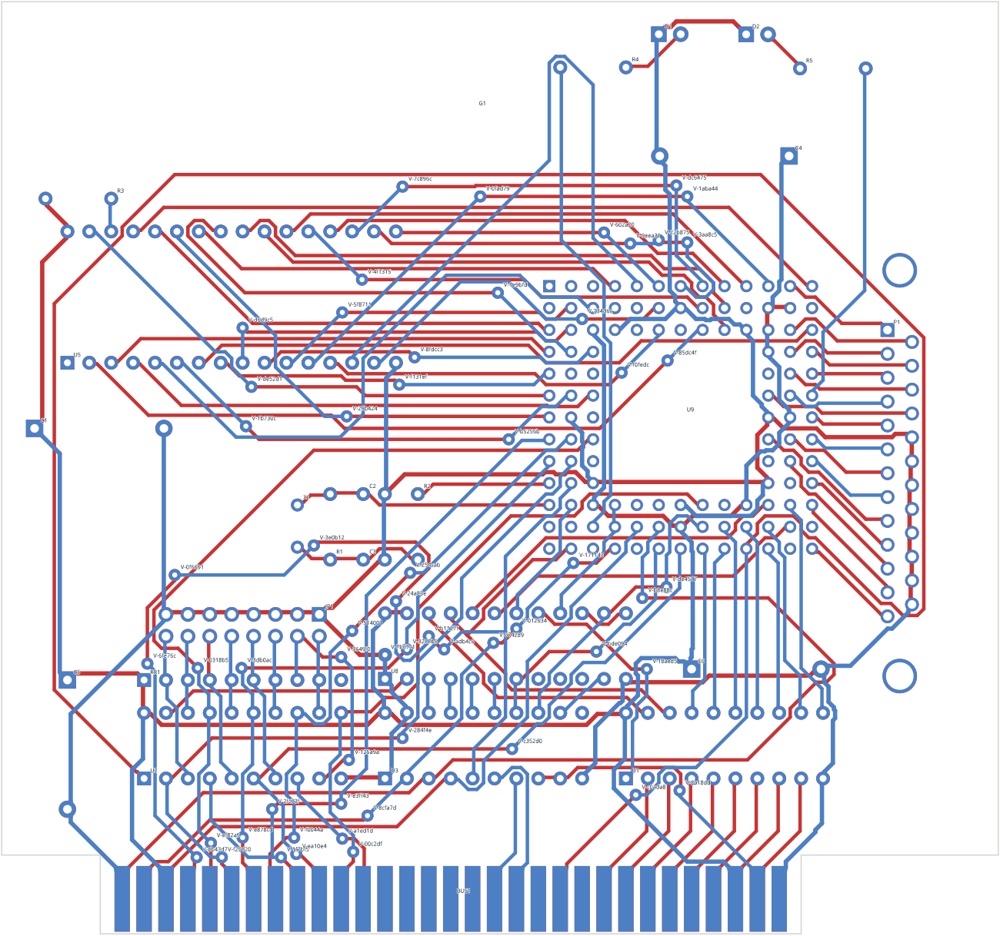

# The whole-board router (`pcb-router`)

`pcb-router` is the project's routing core. It replaces the per-net,
file-to-file sequential router described in the
[trust audit](reviews/2026-09-21-trust-audit.md).

```sh
cargo run --release -- route-kicad-board \
  <source-directory> <board-id> <output-directory> [config.json|auto]
```

The command parses the board once, routes every connection in memory, checks
the result with an exact internal verifier, writes the project once, and runs
native KiCad verification once as the final gate. It exits non-zero when the
internal verifier or KiCad finds anything.

## Results (2026-09-21, one thread, cold boards, zero initial copper)

| Board | Nets | `pcb-router` | Old internal router | Freerouting 2.2.4 |
| --- | ---: | --- | --- | --- |
| ECC83 | 9 | 9/9, **0.2 s**, 1 via, 344 mm | 9/9, 104 s, 8 vias, 388 mm | complete |
| Complex hierarchy | 50 | 50/50, **1.2 s**, 0 vias, 1330 mm | 50/50, 487 s, 10 vias | 49/50 (one open), 8.5 s routing |
| PIC programmer | 34 | 34/34, **2.9 s**, 1 via, 1907 mm | 34/34, 308–1272 s, 39–53 vias | 33/34 (one open) |
| Interf-U | 110 | 110/110, **22.5 s**, 58 vias, 4789 mm | 94/110 at the 1800 s cap | 110/110, 49 s routing, 44 vias, 5051 mm |

Times are routing only; the single native KiCad gate adds about 6 s per
board. Every `pcb-router` result above passes native ERC/DRC/parity with zero
findings and zero internal violations. The Freerouting hierarchy and PIC
figures are the retained ones from `docs/current-status.md`; ECC83 and
Interf-U were re-run during the audit.



## How it works

1. **Lowering (once).** The adapter (`crates/pcb-kicad/src/board_router.rs`)
   turns pads, holes, rule areas, existing copper, the outline and the resolved
   per-net rules into a format-independent `pcb_router::Board`.
2. **Lattice.** A pitch and phase are chosen so that as many pad centres as
   possible fall on nodes (through-hole boards live on an imperial lattice and
   a one-track channel between two pads is only usable with a node row in its
   centre).
3. **Static maps (once per rule class).** Per layer and node: free, blocked, or
   owned by one net (its own pads). Nodes within one chord sagitta of an
   obstacle get exact per-edge checks, so there is no blanket safety margin
   eating narrow channels.
4. **Occupancy.** Routed copper is stamped into per-class occupancy maps as the
   zone where another net's centreline or via may not be. Stamps are reference
   counted per net, so rip-up is an exact decrement.
5. **Negotiated congestion.** Every net is routed allowing overlaps at a cost.
   Contested nodes get more expensive from iteration to iteration (present
   factor and history). Only nets still in conflict are touched, and of those
   only the conflicting branches; the remaining tree components are
   reconnected.
6. **Search.** A* over (layer, node) with preferred layer axes, bend and via
   costs. Few-target searches use a layer-direction-aware bound; many-target
   searches (power nets, tree components) use an exact coarse octile distance
   transform.
7. **Resolution.** If negotiation stalls, the most contested nets are removed
   and reinserted with all other copper as hard obstacles; partial trees are
   kept and reported.
8. **Cleanup.** Each net is rerouted alone with pure geometric cost and a high
   via cost; the result is kept only if strictly cheaper.
9. **Verification.** `pcb_router::verify` measures true distances between all
   emitted copper, obstacles and the outline, independent of the lattice.

## Two-level search

Every connection is first planned on a coarse graph of 16 x 16-node tiles
(per layer, with via edges between layers). A tile costs more the fuller it
is, with the fill maintained incrementally from the occupancy maps, and more
again where conflicts keep happening. The lattice A* then runs only inside the
planned corridor (one tile of margin); nets that keep losing negotiations get
wider corridors, and a failed corridor falls back to the plain window and the
whole board. This is the "graph layer tells the geometric layer where to go"
idea; it halved the time on the large boards and reduced vias and copper.

## Copper pours

Zones covering at least a tenth of the board are pours. Pads inside a pour
are connected; other pads get a short stub and a via to the nearest free pour
node. After routing, the pour's solid pieces are labelled on the lattice;
islands holding pads are stitched to the main piece with vias, and pads that
cannot be stitched are routed to it. Around pads that connect to a pour, other
nets pay extra so the thermal spokes survive. If the router or KiCad still
sees open items, the pour nets are routed as tracks instead and the better
board is kept.

## Known limits / next steps

- Two copper layers, through vias only (the core is N-layer; the adapter is
  not yet).
- Existing tracks are obstacles; they are not yet adopted as tree components.
- Only pours covering at least 10 % of the board are connected through;
  smaller zones are treated as routing. Arcs in existing copper are refused.
- 45° lattice output, no any-angle/arc post-processing yet.
- Rules come from the `.kicad_pro` (net classes, patterns, minimums); custom
  DRC rules and per-layer rules are not read.
- Single threaded. Independent nets can be routed in parallel.
- No pin/gate swapping, no differential pairs, no length tuning.
