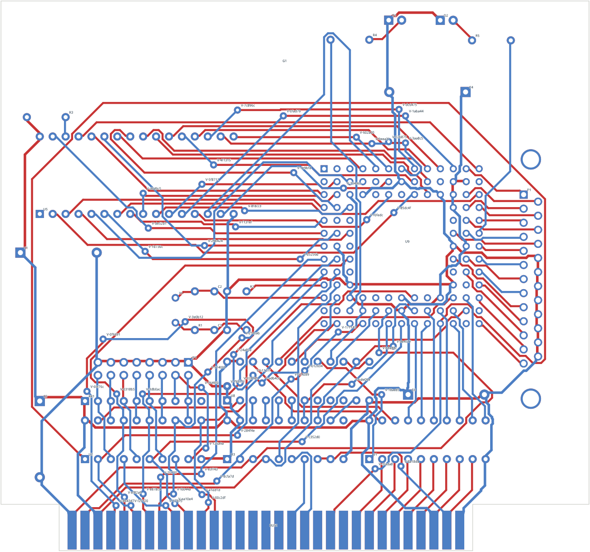

# The whole-board router (`pcb-router`)

`pcb-router` is the project's routing core. It replaces the per-net,
file-to-file sequential router described in the
[trust audit](reviews/2026-09-21-trust-audit.md).

```sh
cargo run --release -- route-kicad-board \
  <source-directory> <board-id> <output-directory> [config.json|auto]
```

The command parses the board once, routes every connection in memory, checks
the result with an exact internal verifier, writes the project once, and runs
native KiCad verification once as the final gate. It exits non-zero when the
internal verifier or KiCad finds anything.

A config file that only tunes the router (no `connection_rules`) still takes
its rules from the project. `{"frame_directory": "<dir>"}` additionally
writes the board after every negotiation iteration as
`<dir>/attempt-NN/frame-NNNN.kicad_pcb`; `docs/images/animate.py routing`
turns those frames into a GIF (the README's routing animation is
Interf-U, cold, 81 iterations).

## Results (2026-09-21, one thread, cold boards, zero initial copper)

| Board | Nets | `pcb-router` | Old internal router | Freerouting 2.2.4 |
| --- | ---: | --- | --- | --- |
| ECC83 | 9 | 9/9, **0.2 s**, 1 via, 344 mm | 9/9, 104 s, 8 vias, 388 mm | complete |
| Complex hierarchy | 50 | 50/50, **1.2 s**, 0 vias, 1330 mm | 50/50, 487 s, 10 vias | 49/50 (one open), 8.5 s routing |
| PIC programmer | 34 | 34/34, **2.9 s**, 1 via, 1907 mm | 34/34, 308–1272 s, 39–53 vias | 33/34 (one open) |
| Interf-U | 110 | 110/110, **22.5 s**, 58 vias, 4789 mm | 94/110 at the 1800 s cap | 110/110, 49 s routing, 44 vias, 5051 mm |

Times are routing only; the single native KiCad gate adds about 6 s per
board. Every `pcb-router` result above passes native ERC/DRC/parity with zero
findings and zero internal violations. The Freerouting hierarchy and PIC
figures are the ones retained by the trust audit of 2026-09-21; ECC83 and
Interf-U were re-run during the audit.



## How it works

1. **Lowering (once).** The adapter (`crates/pcb-kicad/src/board_router.rs`)
   turns pads, holes, rule areas, existing copper, the outline and the resolved
   per-net rules into a format-independent `pcb_router::Board`.
2. **Lattice.** A pitch and phase are chosen so that as many pad centres as
   possible fall on nodes (through-hole boards live on an imperial lattice).
   Tight channels count ten times more than pad centres: a channel between two
   neighbouring pads that the narrowest track fits through with less than
   half a pitch to spare needs a node row within that slack of its centre, or
   the pad row is a wall. (ngdevkit's 0.75 mm BGA with 0.28 mm balls and
   0.15 mm rules leaves 0.01 mm of slack; 0.125 or 0.075 mm lattices reach
   its inner balls, 0.1 mm cannot.)
3. **Static maps (once per rule class).** Per layer and node: free, blocked, or
   owned by one net (its own pads). Nodes within one chord sagitta of an
   obstacle get exact per-edge checks, so there is no blanket safety margin
   eating narrow channels.
4. **Occupancy.** Routed copper is stamped into per-class occupancy maps as the
   zone where another net's centreline or via may not be. Stamps are reference
   counted per net, so rip-up is an exact decrement. They are exact: a node's
   disc covers the cells closer than the clearance (in whole nanometres), so
   two tracks at exactly their clearance are legal, as KiCad has it (0.4 mm
   pad pitch with 0.2 mm tracks and clearance). On a lattice no node lies
   closer to an axis step than to its ends; a diagonal step passes the nodes
   on its bisector closer, so it stamps those too, and every node stamps,
   into a second family of maps, the start cells of the diagonal steps that
   would pass it too closely (one lookup per diagonal move in the search).
   The distance between two segments of a lattice is always attained at a
   node of one of them, so these two stamps together are exact. What stays
   quantised is the spacing of parallel diagonals: multiples of pitch/√2,
   so on a 0.127 mm lattice three 0.25 mm tracks with 0.2 mm clearance fit
   an axis channel of 1.15 mm but not a diagonal one (5 steps are 0.449 mm).
5. **Negotiated congestion.** Every net is routed allowing overlaps at a cost.
   Contested nodes get more expensive from iteration to iteration (present
   factor and history). Only nets still in conflict are touched, and of those
   only the conflicting branches; the remaining tree components are
   reconnected. A net in conflict for eight iterations running is ripped up
   whole every eighth: the branches it kept may be what boxes the other net
   in (Interf-U's edge fingers, where a kept branch fenced the neighbour's
   finger on the only layer that reaches it). Branches a rip-up keeps stay
   stamped while the net is searched again; the search masks its own stamps
   (`mask_own`, an epoch that never repeats: the old Jacobi mask reused
   generation 1 for every net, so a previous net's stamps passed for the
   current one's). Fixed branches (plane skeletons, escape stubs) therefore
   hold their ground even in the hard rerouting at the end, where a bulk
   rip-up used to unstamp them and other nets crossed them.
   `escape_stub_mm` (off) fixes a straight stub outward for every pad of a
   fine-pitch row before negotiation; it did not gain on Tiny Tapeout or
   ColdFire yet. `fixed_plane_stubs` connects every surface pad of a pour
   net to an inner plane by a stub and via before the signals route (only
   inner planes count: on the empty board every pad touches its own
   layer's pour, which the signals then cut to pieces); the KiCad ladder
   runs it as a rung when the plain pour connection left pour-net pads
   open (Framework mainboard half: 13 open -> 3, then complete as tracks). Under `PCB_ROUTER_DEBUG` the
   conflict spots of stuck nets name the nets stamping them, and
   `PCB_ROUTER_DUMP=x0,y0,x1,y1` (mm) prints the lattice of that region per
   layer once few nets remain (statics, occupancy, the stuck nets' nodes).
6. **Search.** A* over (layer, node) with preferred layer axes, bend and via
   costs. Few-target searches use a layer-direction-aware bound; many-target
   searches (power nets, tree components) use an exact coarse octile distance
   transform.
7. **Resolution.** If negotiation stalls, the most contested nets are removed
   and reinserted with all other copper as hard obstacles; partial trees are
   kept and reported.
8. **Cleanup.** Each net is rerouted alone with pure geometric cost and a high
   via cost; the result is kept only if strictly cheaper.
9. **Verification.** `pcb_router::verify` measures true distances between all
   emitted copper, obstacles and the outline, independent of the lattice.

### The probe ladder (2026-10-03)

On boards with four or more layers and 120 or more connections the KiCad
adapter does not split the ladder's budget by a fixed rule (each rule tried
failed some board: docs/todo.md). Every rung (exclusive planes, connected
pours, plane stubs, pour nets as tracks) is lowered and negotiates for
`probe_seconds` (75) with `Router::probe`, which keeps its whole state; the
rung with the fewest unfinished nets (conflicted or incomplete) is resumed
with `Router::resume` for a third of what is left, then finished and
polished. A probe that finishes everything stops the probing, and only the
leading router stays in memory. The probes run side by side (as many as
fit half the memory available, judged by the first router's size), with
the outcome of probing one after the other: a probe's budget is work, the
fewest unfinished nets lead, a tie goes to the earlier rung, and only the
probes up to a rung that finishes everything count. The layout's placement
race probes its placements the same way. Finer pitches follow as before when
connections stay open.

### Hole clearance

Copper keeps two distances from a via: the copper clearance from its ring
and the board's hole clearance from its drill; with a thin ring the second
binds. Both enter the stamps (trace and via against via) and the static
map around pads, and the exact verifier checks copper-to-hole as well as
hole-to-hole.

### Memory (2026-10-03)

A thread's search scratch is the largest part of a big board's footprint
(cost, parent and generation marks per lattice state, one scratch per
worker thread), followed by the per-class occupancy and static maps. Marks
that only deduplicate within one operation are bitsets cleared from the
list of what was touched (stamp marks per map, the own-stamp mask per
thread); search generations are 16-bit and cleared on wrap. ATAT1800 (four
layers, 3952 x 1227 nodes): 8.65 GB -> 5.52 GB peak, identical result.
Next candidates: the static maps per class (41 bytes per node and class)
and fewer scratches on boards where parallel batches are small.

2026-10-09: verbose runs print the maps' sizes after the lattice line
(`memory: ...`). Per node and layer, for C rule classes of which S are
searched (net classes and their neck classes; the rest are pour brushes,
read only by the pour model): static maps 7C bytes (the trace map 4, the
edge directions 1, their owner 2), per node 1 (vias blocked) and for a
searched class 6 more (via owner, free layers), and the mask openings'
differences only where they are; occupancy 6C (a 16-bit count for the trace and two diagonal maps) plus
2C per node for the via maps; the search records `hot` 12S (were 16C);
history, guard and cover 12 plus 4 per node; a search scratch 12 per state
(were 20: the tree and target marks are hash maps of the few nodes they
hold), one for the router and one per worker thread that routes a batch.
Copies of a router (the via reduction's snapshot, the layout's trials)
share the static maps and leave the scratch, the stamp marks and `hot`
behind; the via reduction's whole copy had doubled every board's peak.
Route mode, one attempt, 4 cores, x155 -> x161: Castor 1391 -> 687 MB,
SNSP-CPU-01 2209 -> 1536, katia 6292 -> 4315, identical routes; layout
mode (x155 -> x160, 2 threads): CyberKeeb2040 6916 -> 3395 MB, Qfwfq 3330
-> 1414, identical boards. Threads hardly speed the search (k30-SBC: 34.2, 32.4, 31.3 s on 1,
2, 4 threads) and each holds a scratch: run boards side by side with few
threads each (`RAYON_NUM_THREADS`, the runners' `--threads`).

## Two-level search

Every connection is first planned on a coarse graph of 16 x 16-node tiles
(per layer, with via edges between layers). A tile costs more the fuller it
is, with the fill maintained incrementally from the occupancy maps, and more
again where conflicts keep happening. The lattice A* then runs only inside the
planned corridor (one tile of margin); nets that keep losing negotiations get
wider corridors, and a failed corridor falls back to the plain window and the
whole board. This is the "graph layer tells the geometric layer where to go"
idea; it halved the time on the large boards and reduced vias and copper.

## Copper pours

Zones covering at least a tenth of the board are pours. Pads inside a pour
are connected; other pads get a short stub and a via to the nearest free pour
node. After routing, the pour's solid pieces are labelled on the lattice;
islands holding pads are stitched to the main piece with vias, and pads that
cannot be stitched are routed to it. Around pads that connect to a pour, other
nets pay extra so the thermal spokes survive. If the router or KiCad still
sees open items, the pour nets are routed as tracks instead and the better
board is kept.

### Plane skeleton (fallback)

When a pour ends up shredded by the signal routing, stitching after the fact
cannot repair it (ngdevkit's ground pour: 1536 pieces, 171 stranded pads,
274 stitching vias for six of them). The skeleton secures the pour's
continuity first: the pour net is routed as a plain tree, biased six-fold
onto the layer its pours cover most, against the still empty board, and
that tree is *fixed* for the rest of the run (never ripped up, never the
pour net's conflict). After routing, every part of it that lies in solid
pour copper is trimmed away again, so only the hops the pour cannot provide
remain, and the usual stitching adds what the trimmed pieces still need.
Where the pour alone would have done, the skeleton costs signals room on the
plane layer (dut-c3: 7 more vias, 8 % more copper), so it is the second rung
of the attempt ladder, not the default.

## The attempt ladder

`route-kicad-board ... auto` runs attempts until one is clean (no open
items, no internal violation, no starved thermal in KiCad's DRC) and keeps
the best otherwise: pours connected; pours connected with the plane
skeleton; pour nets as tracks; then the same on finer lattices (0.075 and
0.05 mm) as long as the time projected from the previous attempt stays under
`refine_budget_seconds` (240 s). StickHub is the board that needs the finer
rung: 8 open on the regular lattice, clean at 0.075 mm.

## Via reduction

Once the board is complete, the nets that have vias are renegotiated from the
converged state with the via cost doubled per round, up to three rounds. A
round is kept only if nothing opens and the via count drops; otherwise the
state is restored. This is where most of the via savings come from: the
cleanup pass alone cannot remove a via, because a single net rerouted against
all other copper is boxed in, while renegotiation lets the neighbours move.

## Known limits / next steps

- Two copper layers, through vias only (the core is N-layer; the adapter is
  not yet).
- Existing tracks are obstacles; they are not yet adopted as tree components.
- Only pours covering at least 10 % of the board are connected through;
  smaller zones are treated as routing. Arcs in existing copper are refused.
- 45° lattice output, no any-angle/arc post-processing yet.
- Rules come from the `.kicad_pro` (net classes, patterns, minimums); custom
  DRC rules and per-layer rules are not read.
- Nets with disjoint search windows are routed in parallel; on large boards
  with long nets almost nothing is disjoint and the router is effectively
  single threaded. Jacobi-style parallel routing of overlapping nets (each
  against the current copper, then all re-stamped) was tried and converges
  far worse (Interf-U: 448 s and 44 vias against 81 s and 28 vias); the
  option `jacobi_batch` is kept off.
- No gate swapping, no differential pairs, no length tuning. Pin swapping
  is a separate step before routing ([pin-swap.md](pin-swap.md)).
